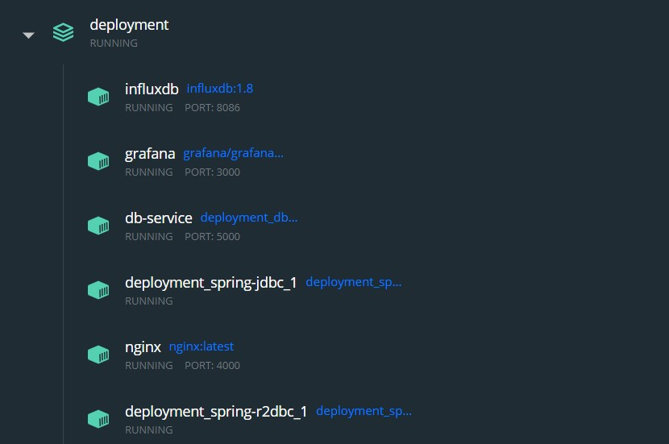

The deployment will include the following containers.



## How to run:

Initialize with:

```shell
docker-compose rm -f
docker-compose pull
docker-compose up --build --force-recreate --remove-orphans db-service nginx spring-jdbc spring-r2dbc influxdb grafana 
```

Run tests with:

```shell
docker-compose run --rm k6 run /k6-scripts/load-test.js -e TYPE=jdbc -e USERS=20
```

Before each test you should run the following script to make every load test indipendent from the previous executions.

```sql
delete from books b where b.book_id <> 1;
delete from orders ;
```

Datas will be available on the grafana dashboard reachable
at: http://localhost:3000/d/k6/k6-load-testing-results?orgId=1&refresh=5s

