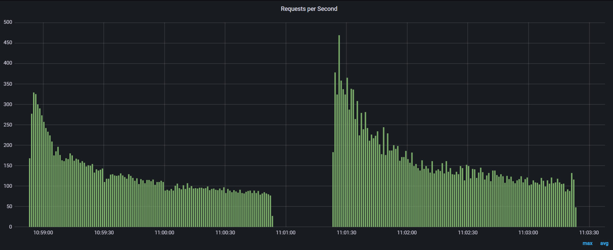
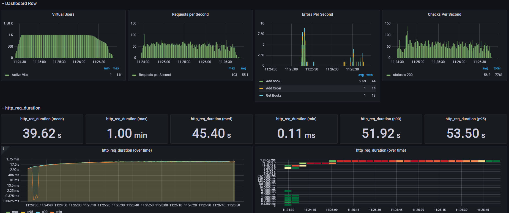
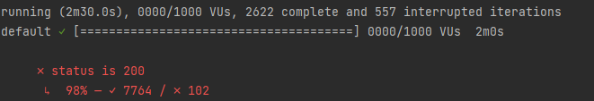
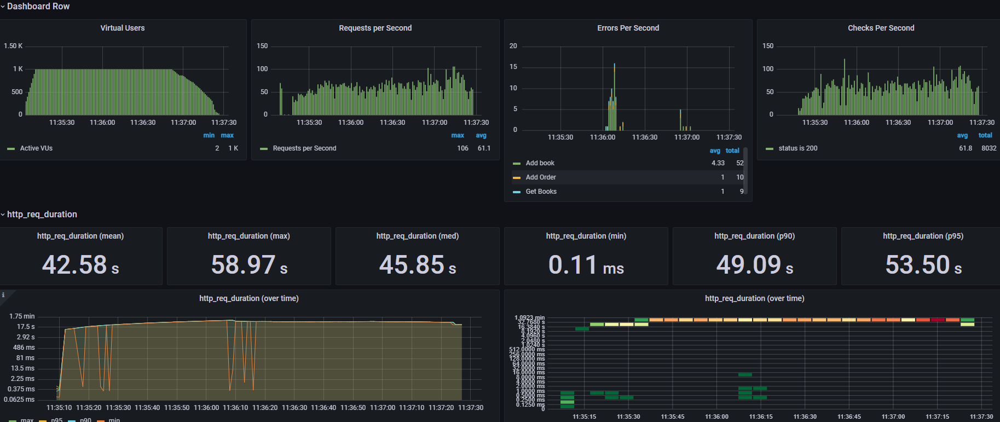
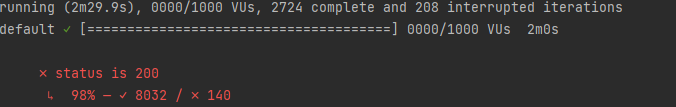
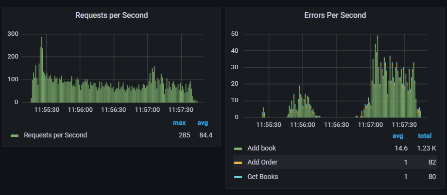
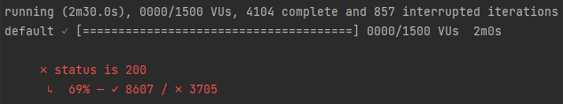
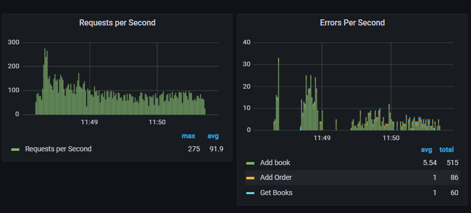
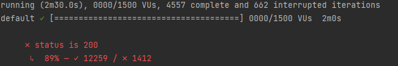

## SPECIMEN 1:
- Concurrency: 1000 / 750 / 250 / 100 / 10
- Containers: 1
- Resources:
    - CPU: 2
    - RAM: 2 gb
    - POOL size: 20
    
### Output 1:
- R2DBC: 5178 / 5210 / 4709 / 5184 / 5167
- JDBC:  6099 / 6271 / 5631 / 5617 / 6648

### Reactions:
With 10 concurrent users performance are way better with jdbc blocking drivers (the second slope)
and this is somehow an expected result.

If we increase concurrent users even to 1000 the performance comparison remains quite similar, 
having JDBC always on top.

---------------------------------------------

## SPECIMEN 2:
- Concurrency: 1000 / 1500
- Containers: 1
- Resources:
  - CPU: 1
  - RAM: 1 gb
  - POOL size: 20
  
### Output 2:
- R2DBC: 2724 / 4557
- JDBC:  2622 / 4104

### Reactions 2:

Let's see how things change having only 1 Core and 1 GB of RAM available for each container, increasing concurrency to 1500 virtual users.

For the JDBC case, with 1000 requests as you can see we start hitting some errors due to request timeout (60 seconds).
Those errors represent only the 2% of the requests done. I coud have configured the timeout to last longer, but I think that is correct to consider
60seconds for a simple web request as an error. 

For the R2DBC case instead, we have FINALLY slightly better results, with the same 
percentage of errors (2%)

Finally, for 1500 concurrent user we can see what HIGH concurrency really means.
As you can see in the following graph, we had more than 31% of requests hitting 60s (thus resulting as errors)

JDBC

Instead with R2DBC only 11% of requests hitted the 60s limit. 

## SPECIMEN 3:
- Concurrency: 1500
- Containers: 1
- Resources:
  - CPU: 3
  - RAM: 2 gb
  - POOL size: 20

### Output 3:

- R2DBC: 5437 complete and 7% errors
- JDBC:  7664 complete and 2% errors

