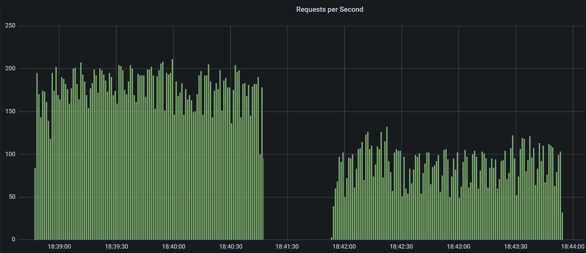

## Specimen 1:
- Concurrency: 500 / 250 / 100 / 10
- Items retrieved: 6000 / 3000 / 1500
- Containers: 1
- Resources:
    - CPU: 2
    - RAM: 2 gb
    - POOL size: 20
    
### Output:
Simple GET Iterations 

    docker-compose run --rm k6 run /k6-scripts/get-test.js -e USERS=500|250 -e TYPE=r2dbc|jdbc

case 1: 500 users

- R2DBC: **4083** / 5373 / 10689
- JDBC: 3321 / 5447 / **22765**

case 2: 250 users

- R2DBC: **4385** / 7364 / 15152
- JDBC: 3520 / 6944 / **20255**

case 3: 100 users

- R2DBC: **4057** / 7636 / 15341
- JDBC: 3247 / 8835 / **22079**

case 4: 10 users

- R2DBC: 4541 / 8823 / 16111
- JDBC: **6841** / **12031** / **26349**

### Reactions:
The results above means that the blocking stack performs better with fewer rows.
Taking also in mind that the reactive output can be processed before the call actually ends (which is the whole point of the reactive drivers)
the result is a clear enough statement: **use reactive drivers only when it makes sense to process a STREAM of data and not a TRICKLE :)**

R2DBC seems to be significantly better only when retrieving 3000 items with more than 100 concurrent users.
This is a very limited scenario.  Are there lots of applications which needs more than 3000 database rows at once,
having more than 100 concurrent users? Considering also that query pagination is an option, the response is obvious.
Full reactive stack is not a good choice for the overwhelming majority of database intensive web applications.
https://www.reddit.com/r/java/comments/k9ozz9/are_you_using_r2dbc_in_production/.

-- Case 500 users and 1.5 k rows -- 

In addition:
- It's still impossible to use Hibernate
- Sequences are not supported https://github.com/spring-projects/spring-data-r2dbc/issues/370
- In my personal opinion, the async syntax is ugly and very difficult to read.

    

